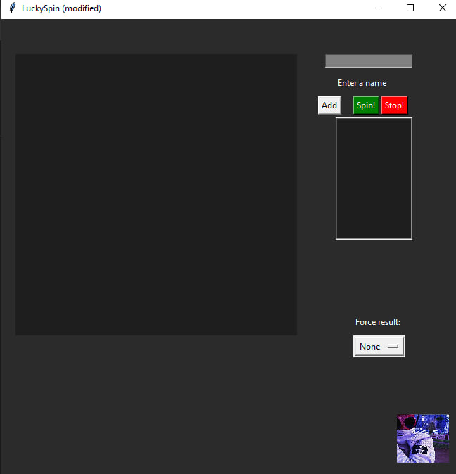
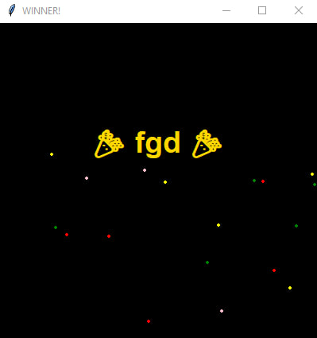

LuckySpin:

LuckySpin is a simple desktop application that randomly selects a name using a spinning wheel. It can be used for giveaways, random picks, or choosing between participants.
It had written by using common tkinter( i know that it`s too old and not relevant)

Features:

1) Add participants to a list

1) Spin a wheel to randomly choose a winner

1) Stop the wheel at any time

1) Option to force a specific result

1) Simple and minimal interface

Interface:

1) Enter a name - you can input any name
1) Add - adds name to the list and shows on the circile
1) Spin! - button to spin
1) Stop! - button to stop and, obviously, to show results
1) Participants list - displays all added names
1) Fosre result - allows manually selecting the winner( the small cheat)

How to Use:

1) Type a name in the Enter a name field.
1) Click Add to include it in the participant list.
1) Repeat for all participants.
1) Click Spin! to start the wheel.
1) Click Stop! to stop the wheel and determine the result.

Result:

To sum it up, you will get the result of your spinning, BUT it will be presented in special form: with animated confetti and with special sound

Secrets: You can write down some names, which can show other results, for instance, if you

write: 'Кирилл' - it will be shown like: 'Славян 4-Muerta'. I hope you will find all this

easter eggs.
Some screenshots to show how it works:
## Screenshot

In the ending you will have this window:
## Screenshot

